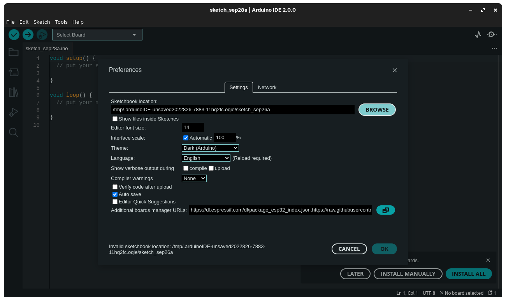
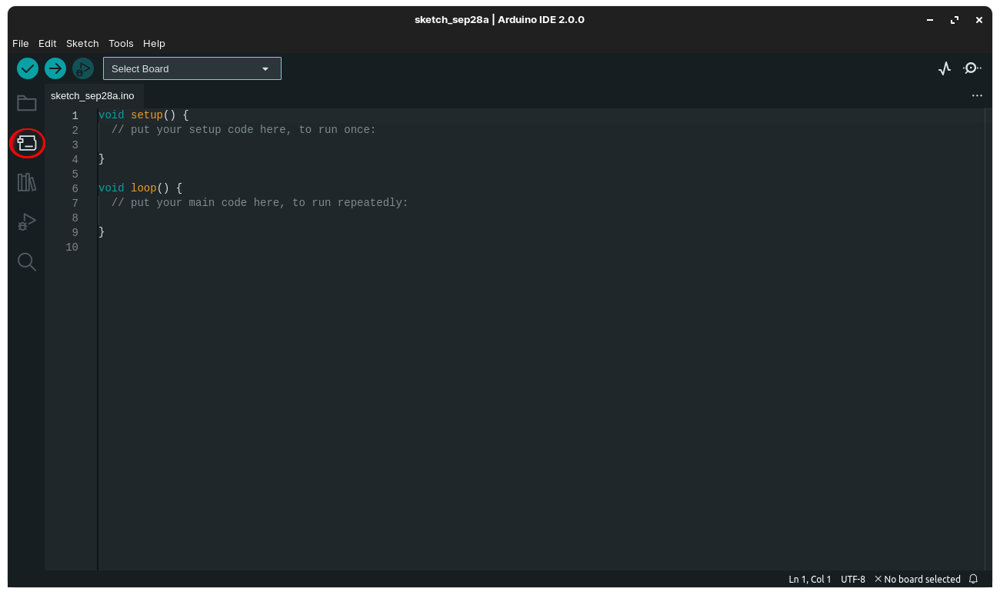
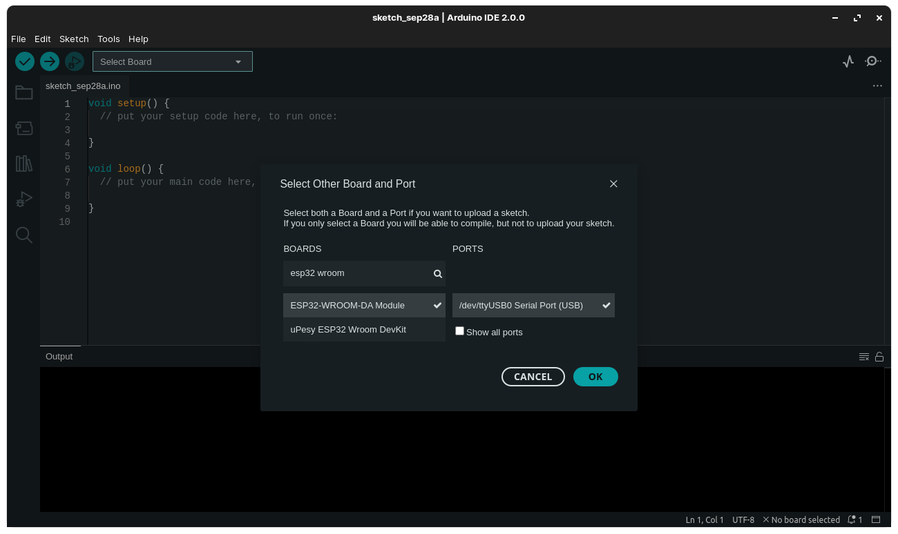
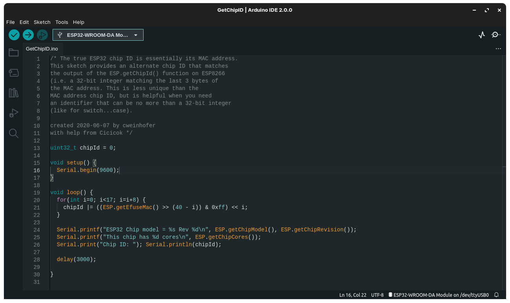
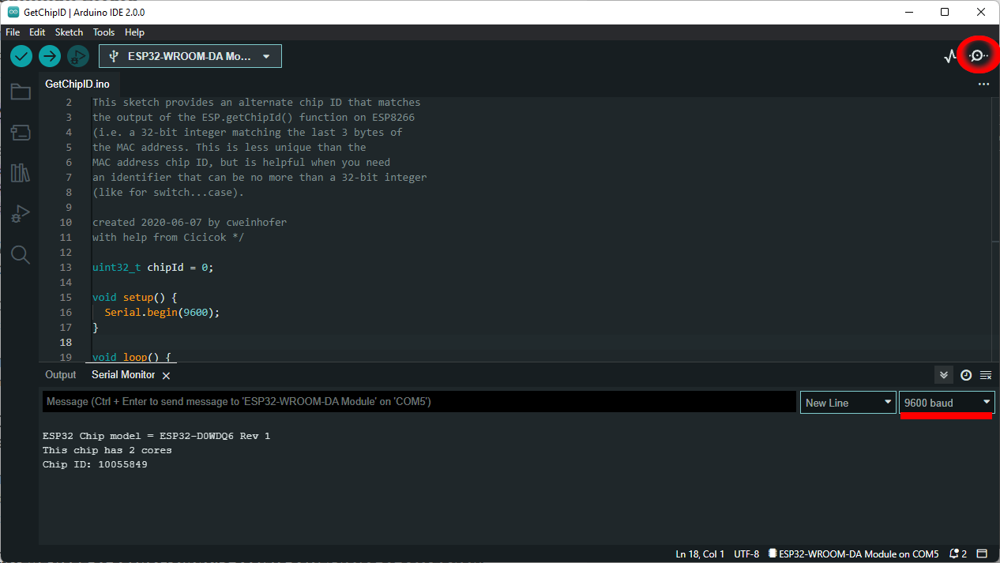
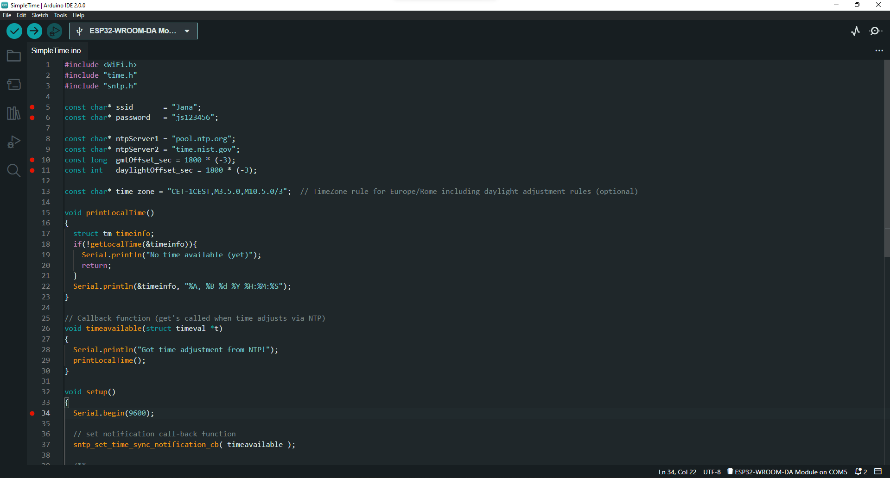
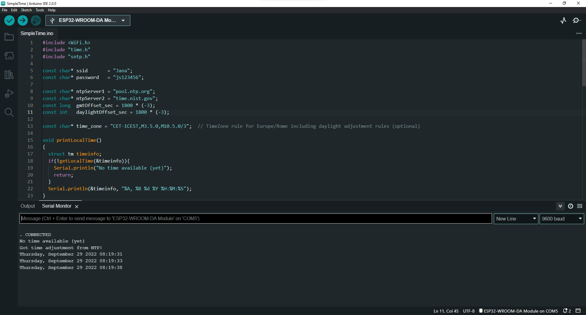

# Tutoriais ESP32

## 1. Instalação:
* Copiar o link:  ```https://raw.githubusercontent.com/espressif/arduino-esp32/gh-pages/package_esp32_index.json``` e colar em File->Preferences->Additional Boards...

    

    * Se um erro "Invalid sketchbook..." aparecer, basta trocar o pasta do Sketchbook para uma de sua preferência por meio do botão **Browse**.

* Clique no menu "Boards Manager".

    

* Procure por ``` ESP32 ``` e instale o pacote mais recente.

* Clique em **Select Board** e clique na opção com o nome da porta que está conectada a placa, ou em **Select other board and port**, pois irá levar para o mesmo menu:

    

* Pesquise por ```ESP32 WROOM``` e clique na primeira opção. Na caixa de seleção ao lado, selecione a porta USB onde a placa está conectada.

* Instalação concluída!

<hr>

## 2. Primeira aplicação: testando a placa.
* Abra o exemplo de código **ChipID** para obtermos algumas informações da placa. Ele pode ser obtido em: File->Examples->ESP32->ChipId->GetChipID

* Altere o parâmetro do método ```Serial.begin()```(linha 16) para ```9600```, como pode ser visto na imagem a seguir:

    

* Clique no símbolo de **V** do menu superior para compilar.

    * Caso surja algum erro relacionado ao Python serial, instale a biblioteca ```pyserial``` e compile novamente. Ela poder ser instalada por meio do seguinte comando no terminal:
        ```
        $ pip install pyserial
        ```
* A seguir, clique no símbolo **->** do menu superior para realizar o upload para a placa.

* Se tudo ocorrer bem, ao abrir o **Serial Monitor** e alterar o valor do **baud** no menu de seleção para ```9600```, as informações serão exibidas em tela.

    

<hr>

## 3. Segunda aplicação: utilizando o Wifi.

Neste tutorial, utilizaremos o Wifi da placa para obter a partir da internet os dados de data e hora local.

* Abra o exemplo de código **SimpleTime**. Ele pode ser obtido em: File->Examples->ESP32->Time->SimpleTime;

* Assim como no exemplo passado, altere o parâmetro do método ```Serial.begin()```(linha 34) para ```9600```;

* Altere os valores das variáveis ```ssid``` e ```password```, respectivamente, para o nome e a senha da rede Wifi em que se deseja conectar (linhas 5 e 6);

* Nas linhas 10 e 11, altere os valores das variáveis ```gmtOffset_sec``` e ```daylightOffset_sec``` para ```1800 * (-3)```. Isso fará com que o fuso horário utilizado seja o de Brasília.

    * Para saber mais sobre o cálculo do fuso, basta seguir este [link](https://lastminuteengineers.com/esp32-ntp-server-date-time-tutorial/).

* Código com as alterações mencionadas acima realizadas:

    

* Se tudo ocorrer bem, ao abrir o **Serial Monitor** e alterar o valor do **baud** no menu de seleção para ```9600```, as informações serão exibidas em tela.

    
